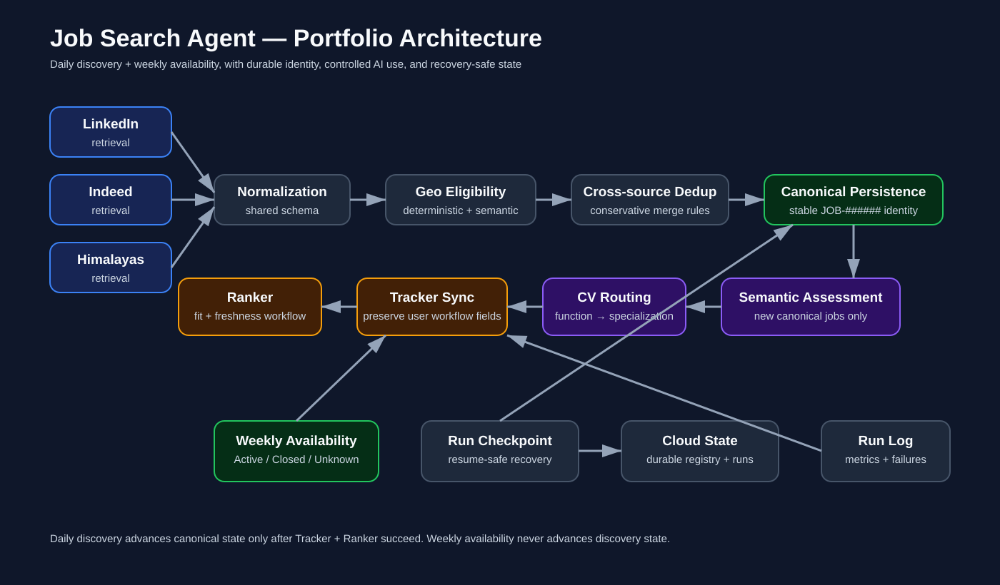
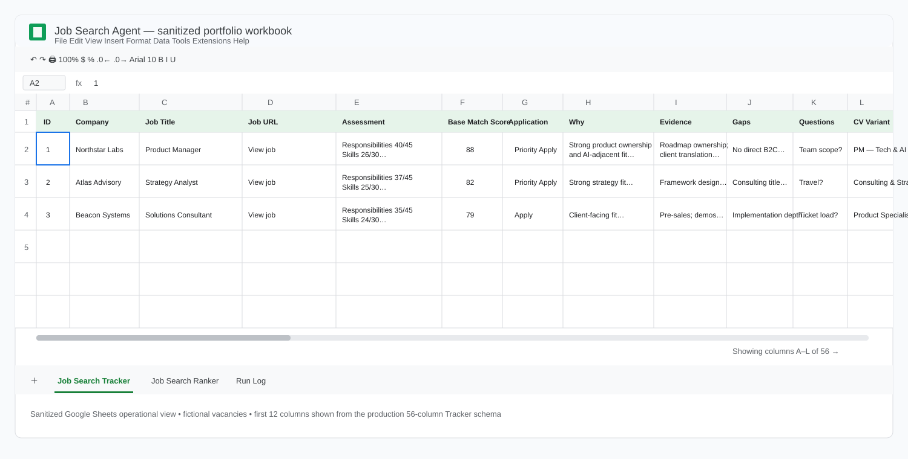
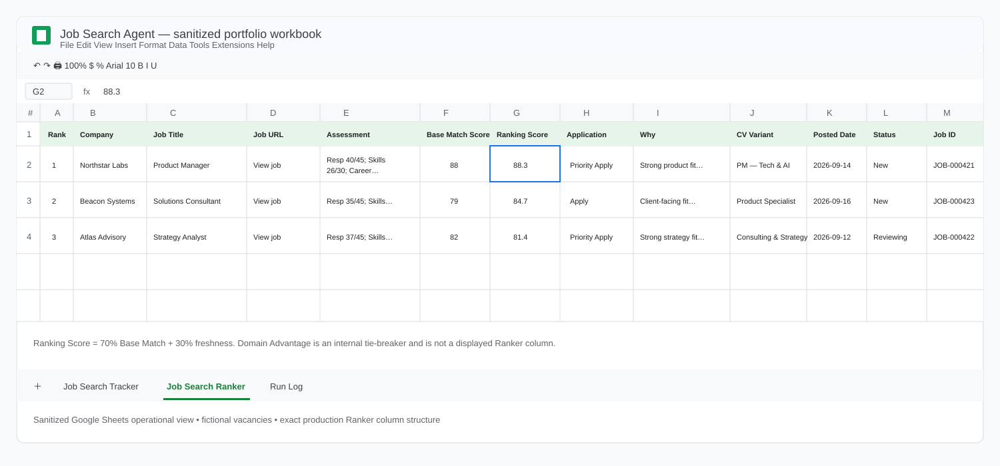
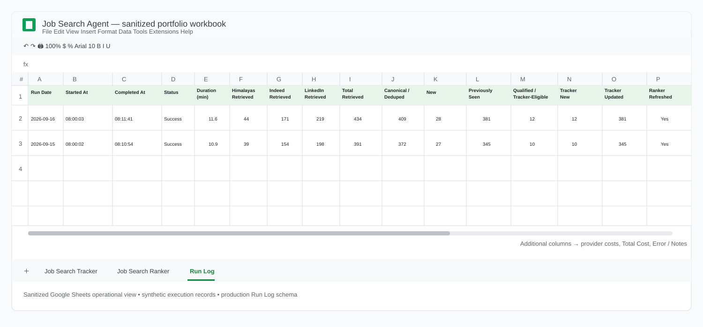

# Job Search Agent

A production job-search decision system that turns qualitative career discovery into structured candidate evidence, broad vacancy retrieval, evidence-bounded semantic evaluation, CV routing, and a reliable human-review workflow.

> **Portfolio version:** this repository is a clean-room, sanitized representation of a private production system. Personal candidate evidence, credentials, live spreadsheet IDs, cloud resource identifiers, retrieved job data, and other production configuration are excluded or replaced with synthetic examples.

## Two ways to use this repository

**I want to understand the project.** Continue through this README for the problem, evolution, architecture, operational workflow, and major design decisions.

**I want to build my own.** Start with [`AI_BUILD_GUIDE.md`](AI_BUILD_GUIDE.md). It is designed so a user can give this repository to an AI assistant and work through **Phase 0 → Phase 1 → Phase 2** using their own evidence, preferences and constraints rather than copying the original candidate's configuration.

## At a glance

- Multi-source retrieval from LinkedIn, Indeed, and Himalayas
- Stable canonical `JOB-######` vacancy identity across duplicates and reposts
- Evidence-bounded semantic matching with explicit anti-hallucination rules
- Career Direction modeled separately from professional capability
- CV routing by role function and specialization
- Google Sheets Tracker + Ranker + Run Log operational workflow
- Recovery checkpoints, run logging, and cost instrumentation
- Separate weekly availability maintenance with conservative `Active / Closed / Unknown` logic
- **7.6k+ canonical vacancies** in the production registry at Phase 2 closure
- **56-column** production Tracker schema
- **23 portfolio reference tests** across core decision, persistence, orchestration, availability, and state-safety rules

## How the project evolved

The project did not begin as an automation exercise. It developed through three questions.

### Phase 0 — What am I actually looking for, and what evidence do I have?

Professional experience was reconstructed project by project rather than relying on an existing CV. Each project was decomposed into scope, problem, role, responsibilities, stakeholders, methods/tools, decisions, deliverables and confirmed results.

That work produced a structured **Candidate Evidence** boundary. Career-direction discovery then separated work the candidate *could* do from work they actually wanted to optimize the search around. Broad role exploration became a YES / MAYBE / NO taxonomy, which then informed role families, retrieval keywords and a set of base CV positioning strategies.

**Output:** professional evidence → career preferences → role taxonomy → CV architecture → localization/search configuration.

### Phase 1 — Can the search and evaluation workflow be automated?

The MVP connected broad vacancy retrieval to normalization, high-confidence eligibility rules, evidence-bounded semantic assessment, CV routing, and a Google Sheets review workflow.

Search terms optimized recall rather than deciding fit. Deterministic rules handled certainty; semantic assessment handled ambiguity. A Tracker preserved the review workflow and a Ranker focused attention on the strongest current opportunities.

**Output:** `Retrieve → Normalize → Filter → Assess → Route → Track → Rank`.

### Phase 2 — Can it operate reliably without me?

Productionization added canonical vacancy identity, conservative deduplication and repost handling, New-only semantic assessment, idempotent spreadsheet writes, caching, recovery checkpoints, run logging, provider-cost instrumentation, a separate availability workflow, containerization and scheduled cloud execution.

The key state boundary became: **canonical state advances only after Tracker synchronization and Ranker refresh succeed**.

**Output:** a stateful system capable of unattended execution with explicit recovery and conservative failure semantics.

The full narrative is in [`docs/case-study.md`](docs/case-study.md). The reusable build methodology is documented in [`Phase 0`](docs/phase-0-discovery.md), [`Phase 1`](docs/phase-1-mvp.md), and [`Phase 2`](docs/phase-2-production.md).

## System architecture



The production deployment runs daily discovery and weekly availability as separate scheduled cloud jobs. See [`docs/architecture.md`](docs/architecture.md) for the audited stage-by-stage design and architecture-to-code map.

## The operational interface is Google Sheets

The production system does **not** use a custom web application. Google Sheets is the human-facing operational layer: Python owns the automated workflow while the spreadsheet keeps review and application decisions inspectable and editable.

The images below are sanitized spreadsheet views with fictional vacancy/execution data. Their structures mirror the production worksheets without exposing private job-search data.

### Tracker — durable review workflow



The production Tracker has **56 columns** spanning job metadata, assessment, CV routing, workflow, provenance and availability. The view above shows the first portion of that schema. New qualified canonical jobs append once; rediscovered jobs refresh automation-owned observation metadata when a Tracker row exists without overwriting user-managed fields such as Status or Notes.

### Ranker — derived attention queue



The Ranker uses the production 13-column structure and narrows attention to active/reviewable jobs. Ranking Score combines **70% Base Match + 30% Freshness**; Domain Advantage is used as a tie-breaker rather than displayed as a Ranker column. Scheduled refreshes run directly from Python, while Apps Script is retained only for selected interactive spreadsheet behavior.

### Run Log — operational observability



The Run Log records timestamps, status, duration, source retrieval counts, canonical/New/Previously Seen counts, Tracker activity, Ranker refresh, provider costs and error context. It is observational and best-effort rather than part of the canonical transaction.

## Matching: fit without CV hallucination

Instead of asking a model for a generic similarity score, the system decomposes Base Match into explicit dimensions:

| Dimension | Weight |
| --- | ---: |
| Responsibilities & Experience Fit | 45 |
| Skills & Capabilities Fit | 30 |
| Career-Direction Fit | 15 |
| Seniority Fit | 10 |
| **Base Match** | **100** |

**Domain Advantage (0–10)** is kept outside Base Match so relevant domain experience can improve ranking without making a new industry a penalty.

The assessment returns **Evidence**, **Gaps**, **Questions**, and a concise **Why**. Candidate Evidence acts as the factual boundary: the model may reason about overlap and transferability but may not invent experience. Python validates the payload and owns Base Match arithmetic, labels, application recommendations, and the career-direction safeguard.

A synthetic version of the assessment contract is available at [`prompts/expanded_semantic_assessment.example.txt`](prompts/expanded_semantic_assessment.example.txt). More detail is in [`docs/matching-methodology.md`](docs/matching-methodology.md).

## Identity and cost control

The system distinguishes a **source observation** from a **canonical vacancy**. Same-run cross-source duplicates are collapsed before persistence. Historical identity resolution then prioritizes known aliases, conservative same-source repost matching, and one unambiguous conservative cross-source historical match before creating a new `JOB-######` identity.

Only **new canonical vacancies** enter the full decision engine and semantic assessment. Previously Seen vacancies update observation state without paying for the same full matching call again.

False merges are treated as more damaging than leaving an occasional duplicate separate.

## Reliability decisions

The production system was hardened around partial failure, not only the happy path:

- canonical registry state advances only after successful Tracker synchronization and Ranker refresh;
- run IDs and checkpoints support recovery without unnecessarily repeating expensive stages;
- resumed runs verify the registry state they started from before they may continue;
- failed runs can preserve recovery state without advancing canonical state;
- deterministic gates precede semantic model calls;
- exact provider usage/cost is recorded where the provider exposes sufficient accounting;
- weekly availability is a separate maintenance workflow and never advances canonical discovery state;
- availability prefers `Unknown` to a destructive false `Closed` classification;
- absence from finite retrieval is **never** treated as closure evidence.

The unattended daily production workflow has been validated end-to-end. At Phase 2 closure, the production registry contained **7.6k+ canonical vacancies**, and the operational Tracker used a **56-column schema**.

See [`docs/production-reliability.md`](docs/production-reliability.md).

## Build your own

The repository is intentionally reusable without pretending the private implementation is a generalized product. [`AI_BUILD_GUIDE.md`](AI_BUILD_GUIDE.md) instructs an AI assistant to derive a new user's configuration rather than copy the reference candidate.

The replication path is:

1. [`Phase 0 — Career Discovery & Candidate Modeling`](docs/phase-0-discovery.md)
2. [`Phase 1 — Build the MVP`](docs/phase-1-mvp.md)
3. [`Phase 2 — Productionize the Agent`](docs/phase-2-production.md)

Synthetic templates for Candidate Evidence, career preferences, role taxonomy, CV variants and search profiles live under `templates/`.

## Portfolio code

The `src/` directory mirrors the substantive production architecture with sanitized reference counterparts: retrieval, normalization, deterministic and geographic eligibility, same-run deduplication, historical canonical persistence, expanded semantic assessment, CV routing, Tracker synchronization, Ranker logic, checkpoints, run logging, cloud-state boundaries, conservative availability maintenance, and daily-vs-weekly orchestration.

These are reference implementations, not a drop-in copy of the private deployed repository.

## Technology

**Python 3.12 · pandas · JobSpy · Anthropic · Mistral · OpenAI · Google Sheets / gspread · Google Cloud Storage · Cloud Run Jobs · Cloud Scheduler · Google Apps Script**

## Repository map

```text
.
├── AI_BUILD_GUIDE.md              # AI-assisted replication entrypoint
├── assets/                        # architecture + sanitized Sheets views
├── config/                        # sanitized configuration examples
├── docs/
│   ├── phase-0-discovery.md       # derive the candidate model
│   ├── phase-1-mvp.md             # build the first working agent
│   ├── phase-2-production.md      # productionize it
│   ├── architecture.md
│   ├── case-study.md
│   ├── matching-methodology.md
│   ├── production-reliability.md
│   └── portfolio-sanitization.md
├── templates/                     # reusable Phase 0 configuration structures
├── prompts/                       # synthetic semantic-assessment contract
├── src/                           # sanitized reference implementation
├── tests/                         # portfolio reference tests
├── .env.example
└── requirements.txt
```

## Running the portfolio tests

```bash
python -m venv .venv
source .venv/bin/activate
pip install -r requirements.txt
python -m pytest -q
```

The 23 reference tests cover matching thresholds, career-direction safeguards, model-output validation, source-aware availability semantics, canonical availability aggregation, cross-source deduplication, historical canonical persistence and repost handling, CV routing, Tracker semantics, Ranker behavior, daily orchestration, weekly maintenance, and daily-vs-weekly state-commit boundaries. Test execution will be re-verified during the final public-release audit.

## Privacy and sanitization

This repository was created independently rather than by making the production repository public. That prevents private Candidate Evidence and production configuration from surviving in inherited Git history. Replicating users should keep their own Candidate Evidence and live configuration private as well. See [`docs/portfolio-sanitization.md`](docs/portfolio-sanitization.md).

## Status

Architecture consistency, the AI-assisted replication framework, the Phase 0 → Phase 1 → Phase 2 narrative, and sanitized Google Sheets operational visuals are complete. Remaining work before public release is the final privacy/security/history, test-execution, claims-evidence, and recruiter-readability audit.
