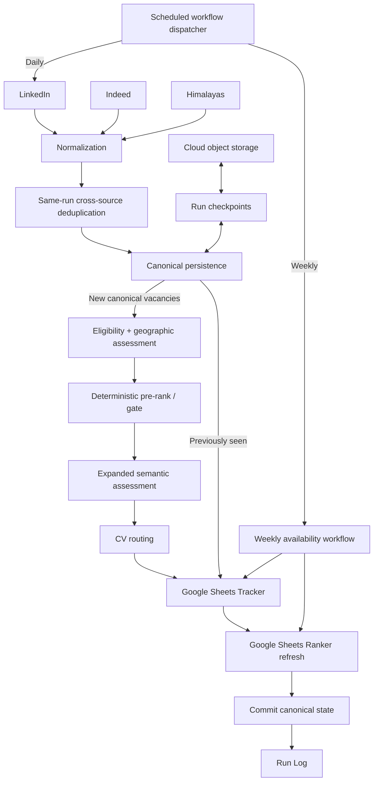

# Architecture

## Overview

The Job Search Agent separates retrieval, normalization, same-run deduplication, durable identity, new-vacancy decision logic, presentation, and availability maintenance into distinct stages. This keeps expensive semantic work conditional, preserves recoverability, and separates canonical system state from human workflow state.

## Architecture-to-code map

| Architecture stage | Portfolio code |
| --- | --- |
| LinkedIn retrieval | `src/jobspy_linkedin.py` |
| Indeed retrieval | `src/jobspy_indeed.py` |
| Himalayas retrieval | `src/himalayas.py` |
| Normalization | `src/normalize.py` |
| Same-run cross-source deduplication | `src/deduplicate.py` |
| Canonical persistence / historical identity | `src/persistence.py` |
| Deterministic eligibility | `src/eligibility.py` |
| Geographic eligibility | `src/geographic_eligibility.py` |
| Semantic scoring rules | `src/matching.py` |
| Expanded semantic assessment contract | `src/expanded_assessment.py` + synthetic prompt in `prompts/` |
| CV routing | `src/cv_routing.py` |
| Tracker sync | `src/tracker_writer.py` |
| Ranker / application workflow | `src/application_workflow.py` |
| Direct Ranker refresh boundary | `src/ranker_refresh.py` |
| Run checkpoint / recovery | `src/run_checkpoint.py` |
| Cloud object storage boundary | `src/cloud_state.py` |
| Run log | `src/run_log_writer.py` |
| Availability classification | `src/availability.py` |
| Weekly availability orchestration | `src/weekly_availability.py` |
| Daily orchestration | `src/pipeline.py` |
| Daily-vs-weekly dispatch | `src/cloud_runner.py` |

The portfolio implementations are intentionally sanitized and compact. They preserve the important system boundaries, decision rules, transaction model, and recovery logic without exposing live configuration, credentials, candidate evidence, or production identifiers.

## Daily workflow

1. Retrieve recent vacancies from LinkedIn, Indeed, and Himalayas.
2. Normalize provider-specific records into one internal schema.
3. Collapse high-confidence duplicates observed within the same run.
4. Resolve observations against the persistent canonical vacancy registry.
5. Split canonical observations into **New** and **Previously Seen**.
6. Send only New canonical vacancies through deterministic eligibility, geographic eligibility, deterministic pre-ranking/gating, expanded semantic assessment, and CV routing.
7. Apply the Tracker qualification gate and synchronize the Google Sheets Tracker. Previously Seen vacancies refresh observation metadata only when they already have a Tracker row.
8. Refresh the Google Sheets Ranker directly from Python.
9. Persist canonical state only after successful Tracker synchronization and Ranker refresh.
10. Write the completed-run summary to the operational Run Log.

## Durable identity

A source listing is an observation; a canonical `JOB-######` ID represents the durable vacancy identity used downstream.

Identity is resolved conservatively in two layers. First, same-run deduplication collapses high-confidence duplicate observations. Remote advertisements can match across different sources or city labels only when normalized company, exact title, and full description are identical and both listings are explicitly remote. Other observations retain the conservative description-similarity and city-compatibility rules. Then persistence resolves historical identity in this order: exact known source alias, strict same-source repost within a bounded window, one unambiguous conservative cross-source historical match, or a new canonical vacancy.

Historical cross-source matching requires exact normalized company/title, sufficiently similar descriptions, compatible locations, and genuinely new source provenance. Strictly identical remote advertisements can cross city labels, while a merely similar description cannot. If more than one historical candidate qualifies, the reference favors creating a new canonical vacancy rather than risking a false merge.

The registry retains source aliases, work model, and sanitized source-URL provenance so future sightings resolve to the right canonical vacancy and later maintenance workflows can reason about individual observations.

## Decision engine

Production follows the principle **filter certainty; score ambiguity**. High-confidence hard exclusions are deterministic; ambiguous professional-fit questions continue to scoring.

Geographic eligibility is a narrow question about whether the role can be performed from the configured target geography. It is deliberately separated from professional fit.

Expanded semantic assessment returns bounded judgments for Responsibilities, Skills, Career Direction, Seniority, and Domain Advantage. Python validates those values and owns Base Match arithmetic, labels, application recommendations, and the career-direction safeguard.

## Google Sheets operational layer

Google Sheets is the human-facing operational interface, not a standalone application UI.

The Tracker is the durable review workflow. New qualified canonical vacancies append once. Previously Seen vacancies never create duplicate rows; if a previously rejected vacancy never entered the Tracker, its absence is legitimate.

The Ranker is a derived active-opportunity view. Production refreshes it directly from Python after Tracker synchronization while preserving spreadsheet formatting and interactive behavior. Google Apps Script can support interactive sheet behavior, but it is not the scheduled Ranker-refresh transport.

## Recovery model

Canonical state and recovery state are separate. Each daily execution has a run ID and run-specific checkpoints. A resumed run verifies that the canonical registry still matches the registry state from which the interrupted execution began; stale recovery state cannot overwrite newer canonical truth.

A failed run may persist recovery artifacts without advancing the canonical vacancy registry. Canonical state advances only after Tracker synchronization and Ranker refresh succeed.

## Weekly availability workflow

Availability maintenance is separate from daily discovery.

1. Read existing Tracker rows whose Availability Status is not Closed.
2. Enrich them with exact source-alias URLs from canonical persistence where available.
3. Gather source-specific availability evidence.
4. Classify each source observation conservatively.
5. Aggregate to canonical status: any Active → Active; all represented sources Closed → Closed; otherwise Unknown.
6. Update only `Availability Status` and `Last Availability Check`.
7. Refresh the Ranker.

The weekly workflow does **not** create canonical IDs, append newly discovered vacancies, run semantic matching, route CVs, update `Last Seen`, or advance the canonical vacancy registry.

Absence from a finite retrieval pool is never closure evidence. Authentication walls, throttling, temporary failures, and ambiguous pages resolve to Unknown. Some affirmative signals are source-specific; for example, a known Himalayas posting returning 404/410 can be treated differently from an ambiguous LinkedIn 404.

## Deployment model

Production uses separate scheduled Cloud Run Jobs for daily discovery and weekly availability maintenance, with Cloud Storage for durable canonical state and run-specific recovery artifacts. Only a successful daily execution may advance canonical cloud state. The weekly workflow may read canonical state for provenance enrichment but does not upload a new canonical registry.

Live project names, spreadsheet IDs, bucket names, scheduler identifiers, credentials, and candidate-specific configuration are intentionally excluded from this portfolio repository.
